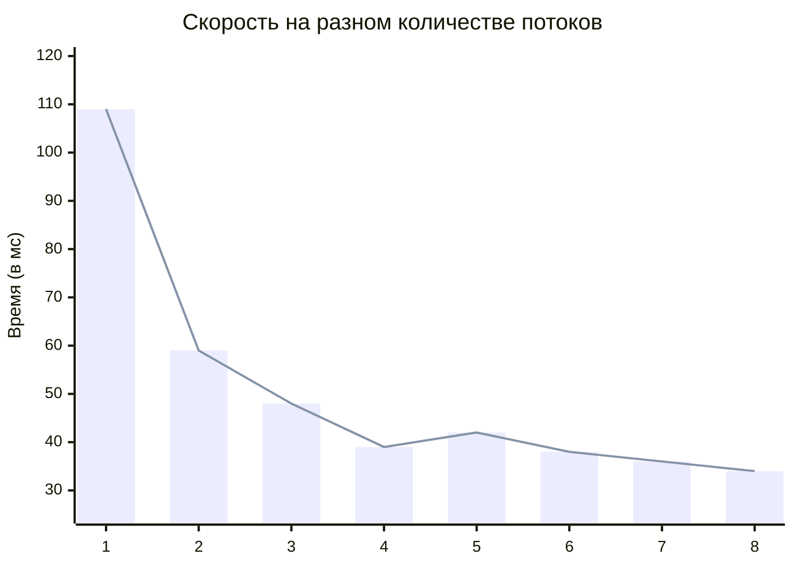
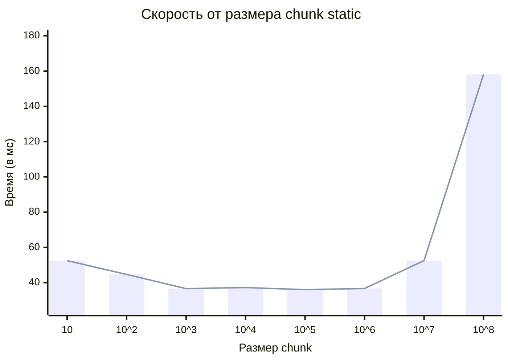
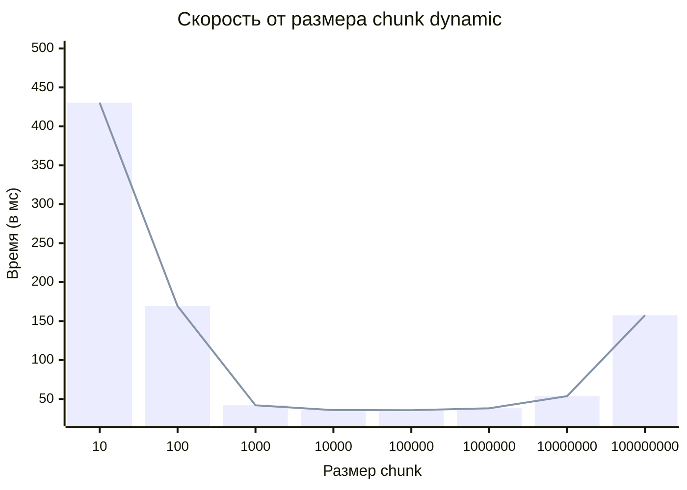
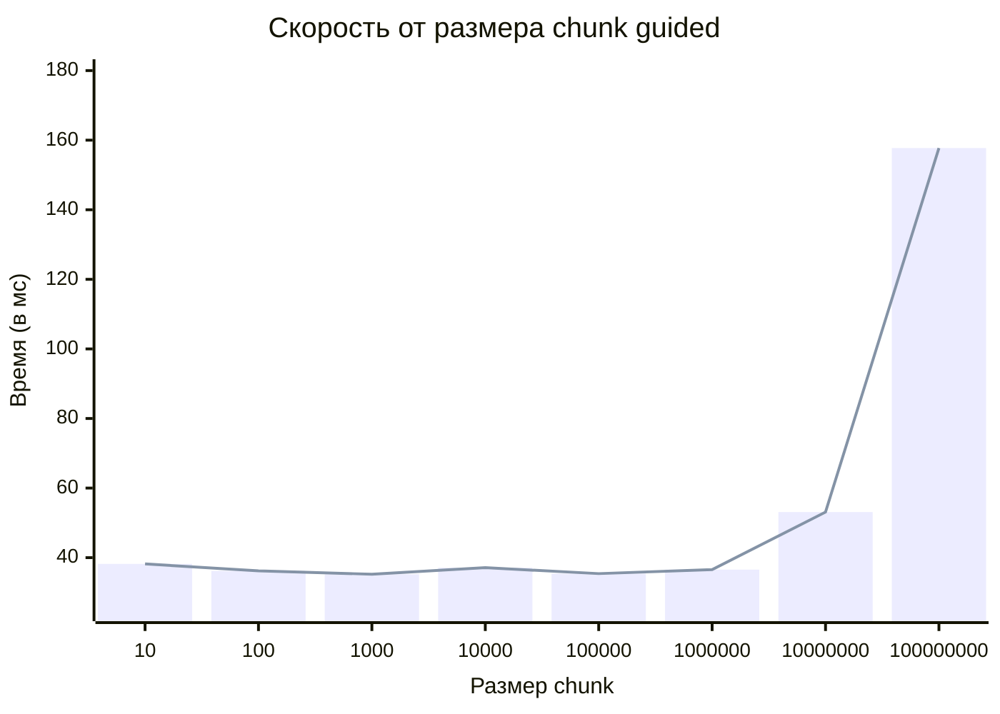
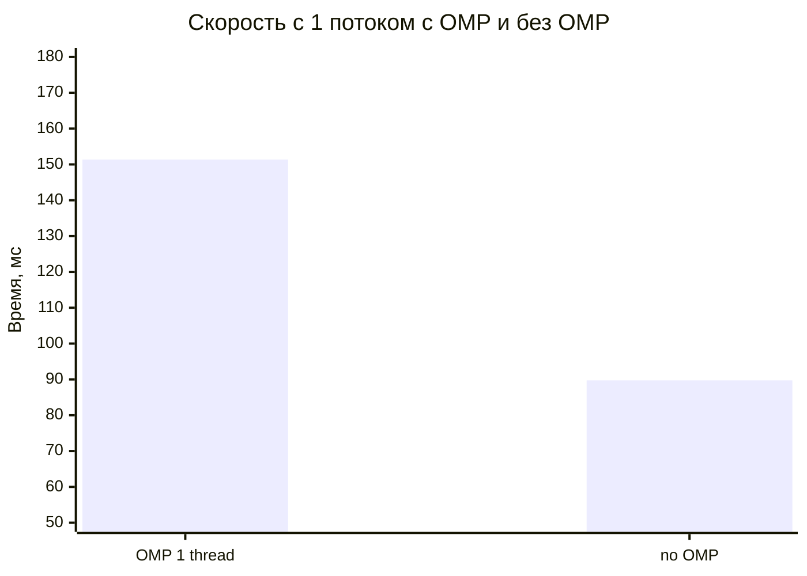
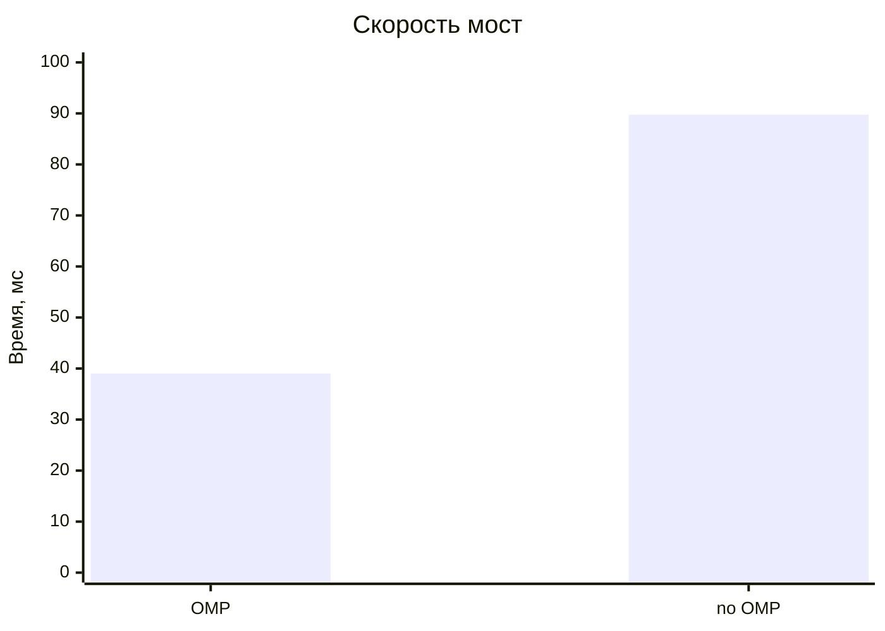
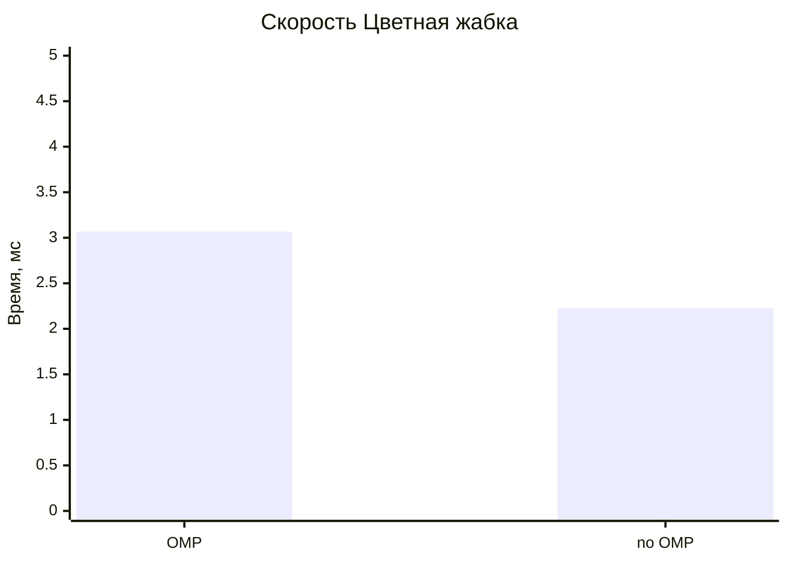
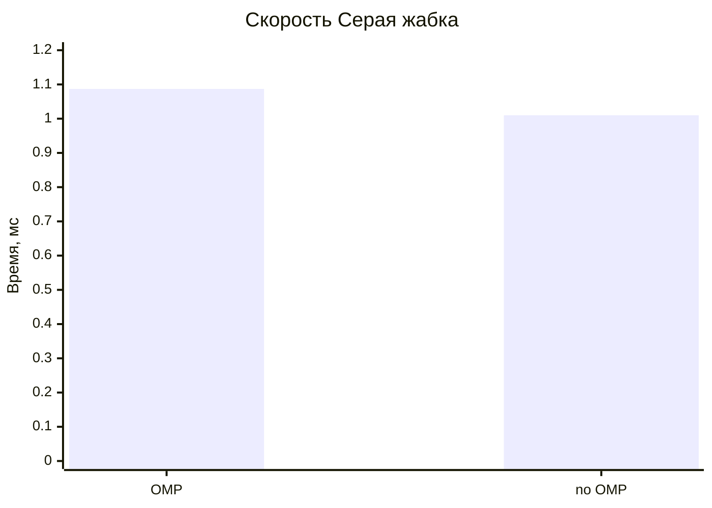

# Отчет по ЛР1 - OpenMP для обработки изображений 
Процессор: 11th Gen Intel(R) Core(TM) i7-1165G7 @ 2.80GHz   2.80 GHz (8 ядер)
## Исследование времени работы при различных числах потоков при одинаковом параметре schedule
На графике представлена зависимость скорости работы от количества потоков на изображении моста:

## Исследование времени работы при различных числах потоков при одинаковом параметре schedule
На графике представлена зависимость скорости работы от размеров chunk при static

На графике представлена зависимость скорости работы от размеров chunk при dynamic

На графике представлена зависимость скорости работы от размеров chunk при guided

## Исследование времени работы с OMP с одним потоком и без OMP
На графике представлено сравнение OMP 1 поток и без OMP

## Исследование времени работы с OMP и без OMP для разных изображений
График для изображения "Мост"

График для изображения "Жабка"

График для изображения "Серая жабка"

